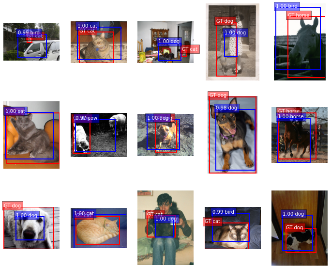
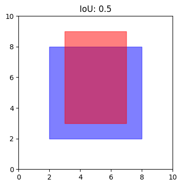

# Classification-and-Localization
## Introduction
In the realm of computer vision, classification and localization are fundamental tasks. Classification involves identifying the category or class to which an object belongs, while localization aims to precisely determine the spatial extent of an object within an image. Combining these tasks enables us to not only recognize objects but also accurately pinpoint their locations, which is crucial for various applications such as object detection, image segmentation, and more.

This repository serves as a resource for researchers, students, and practitioners interested in exploring and implementing classification and localization algorithms. Whether you're working on image recognition, object detection, or any related field, you'll find this implementation useful.

### Dataset
- This repo uses the PASCAL VOC 2012 dataset and for understanding and simplicity, only images with one detected object are selected.

  

### Model
- The ***ResNet50*** model is used for classification and localization.
- Two head model is used, one for classification and one for bounding box regression
- Pre-trained on ``imagenet`` weights and evaluated on IoU (intersection over Union).

### IoU
Intersection over Union is a highly intuitive metric. IoU is calculated by dividing the overlap between the predicted and ground truth annotation by the union of these.

  

### preprocessing.py
***preprocessing.py file preprocesses the Pascal VOC 2012 dataset which resizes the images and extracts the annotations (Bounding Boxes and Labels). It also includes the function to resize the bounding box coordinates according to the image size. It does not in any way contribute to the notebook***

